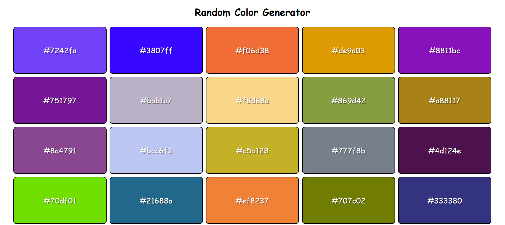

# 🎨 Random Color Generator

A simple and interactive web app that generates a random background color each time you click a button. It displays the generated color code and updates the background dynamically.

**🔗 Live Demo:** [Click here to try it out 🚀](https://kumar-veerendra.github.io/random-color-generator/)

---

## 📸 Screenshot



> 💡 Make sure to place `screenshot.png` in the root of your project to display it here.

---

## 🛠️ Features

- Generates a random hex color code
- Dynamically changes the background color
- Displays the generated hex code
- Simple, clean, and responsive design

---

## 💻 Technologies Used

- HTML5
- CSS3
- JavaScript (Vanilla)

---

## 🚀 Getting Started Locally

To run this project locally:

```bash
git clone https://github.com/kumar-veerendra/random-color-generator.git
cd random-color-generator
open index.html   # or double-click it
```

---

## 📂 Project Structure

```
random-color-generator/
├── index.html
├── style.css
├── script.js
├── screenshot.png
└── README.md
```

---

## 🙌 Contributing

Pull requests are welcome! For major changes, please open an issue first to discuss what you'd like to change.

---

## 📄 License

This project is open-source and available under the [MIT License](LICENSE).

---

## 📬 Contact

Created by [@kumar-veerendra](https://github.com/kumar-veerendra) – feel free to reach out if you have any feedback or ideas!
